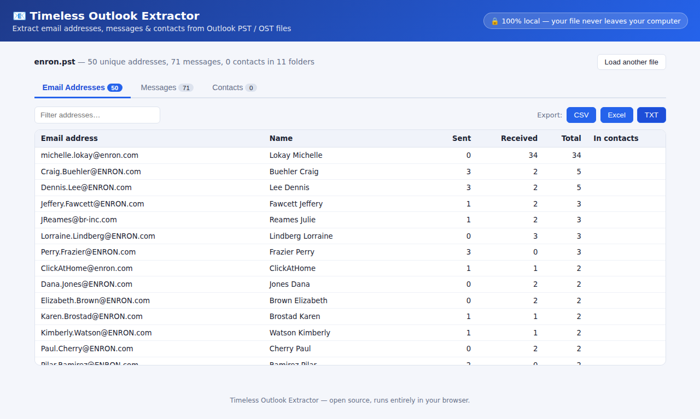

# 📧 Timeless Outlook Extractor

Extract **email addresses, messages, and contacts** from Microsoft Outlook **PST / OST** files — entirely in your browser.

No installation. No upload. Open the page, drop your file, and export your data.



## ✨ Features

- **Email address harvesting** — every unique address found in senders and recipients, with display name, sent/received counts, and whether it appears in your contacts. Export to **CSV, Excel, or TXT** (one address per line).
- **Full message extraction** — browse the folder tree, search messages, read full bodies (plain text or HTML, rendered safely sandboxed). Export the message list to **CSV / Excel**, all messages with bodies to **JSON**, or any single message as a standard **.eml** file.
- **Contacts** — names, email addresses, phone numbers, company, and job title from Outlook contact items. Export to **CSV / Excel**.
- Supports **PST and OST** files, both ANSI and Unicode formats.
- Filters out Exchange-internal junk (legacy `/O=...` DNs, `IMCEANOTES-...` encapsulated addresses).

## 🔒 Privacy

Your file **never leaves your computer**. Parsing happens in a Web Worker inside your browser using [pst-extractor](https://github.com/epfromer/pst-extractor) — there is no server and no network requests are made with your data. You can even load the page once and use it offline.

## 🚀 Usage

1. Open the hosted app (GitHub Pages) — or run it locally, see below.
2. Drag & drop a `.pst` or `.ost` file onto the page (or click to browse).
3. Wait for extraction (progress is shown live).
4. Browse the **Email Addresses**, **Messages**, and **Contacts** tabs, filter with the search boxes, and use the **Export** buttons.

> **Note:** very large files (over ~500 MB) may exceed your browser's memory.

## 🛠 Development

```bash
npm install
npm run dev      # local dev server
npm run build    # production build → dist/
npm test         # Node smoke test against sample PST/OST fixtures
node test/browser.test.js  # full end-to-end test in headless Chromium
```

### Deploying to GitHub Pages

A workflow in `.github/workflows/deploy.yml` builds and deploys automatically on every push to `main`.
One-time setup: in the repository go to **Settings → Pages** and set **Source** to **GitHub Actions**.

## 📦 Tech

- [Vite](https://vitejs.dev/) + vanilla JavaScript
- [pst-extractor](https://github.com/epfromer/pst-extractor) (PST/OST parsing, runs in a Web Worker)
- [SheetJS](https://sheetjs.com/) (Excel export)
